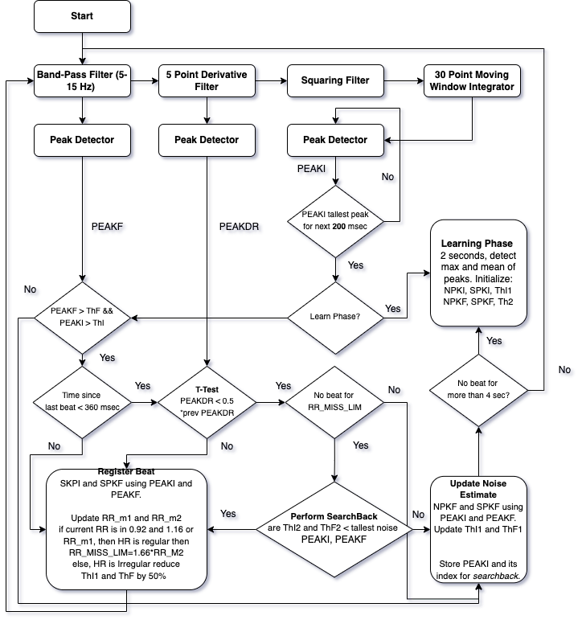
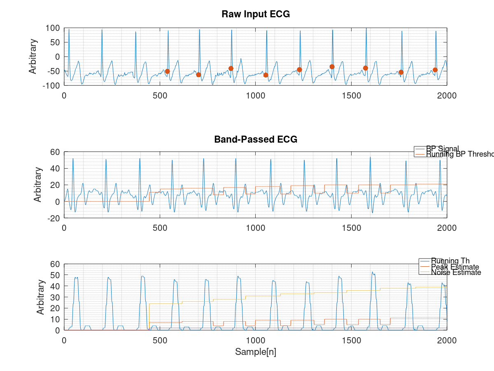

# Fixed Point Implementation of Pan-Tompkins ECG QRS Detector

<p align="center">
  
</p>

## Summary

This is an efficient and fixed-point implementation of the well-known Pan and
Tompkins beat detector [[1]](#1). This helps you to efficiently detect QRS (R beats) in an ECG signal 
robustly.

This code implements an updated version of the published
article where the authors published corrections to a few  filters employed in the paper.
This is a multi-platform implementation and efficient even for MCUs not
designed for signal processing. Yes, we are talking about shifting bits instead of division and 
multiplication.

Many optimizations have been performed to improve the implementation that are detailed in this brief.

## Background and Algorithm

Pan and Tompkins proposed an accurate real-time ECG beat detector in 1985 that has been
successfully used in many commercial devices [[1]](#1). The main stages of the algorithm are
detailed in the folowing diagram.




## Implementation

The whole beat detector is implemented in a single C and header file namely `PanTompkins.c`
and `PanTompkins.h`. Additionally, for testing and debugging purposes a commandline version is provided in `PanTompkinsCMD.c`. 
The main process of the code is implemented as a struct making it easy to access and
debug the program on the go. There are various so called `get_functions` that let the user query any parameter in real-time from the main algorithm.

These are detailed in `PanTompkinsCMD.c`. The code is written in a *sequential* and *organized* manner where each single step is imple-
mented as sub-module for easy access and understanding. The use of the code in any appli-
cation is very simple.

An example output of the code is illustrated below.




## Getting Started

The user only needs to include the header in their main application
and then first call `PT_init()` to initialize and then recursively call `PT_StateMachine((int16 t) sample)`,
where the `sample` is the latest ECG sample acquired from ADC.

`PT_StateMachine` routine implements the state flow of the Pan Tompkins algorithm
and calls the other subroutines such as  filtering and decision making units. Please refer to
`PanTompkins.c` and `PanTompkinsCMD.c` for detailed documentation and example use.


## Get me a coffee :coffee: 
[](https://www.paypal.com/cgi-bin/webscr?cmd=_donations&business=9FAVSPGXTBBQU&currency_code=USD)


## How To Cite 
```
@misc{sedghamiz2021ECG,
      title={Fixed Point Implementation of Pan-Tompkins ECG QRS Detector}, 
      author={Hooman Sedghamiz},
      year={2021},
      eprint={2109.07424},
      archivePrefix={Github},
}
```

## References
<a id="1">[1]</a> 
J. Pan and W. J. Tompkins, "Real-Time QRS Detection Algorithm" IEEE Transac-
tions on Biomedical Engineering, vol. BME-32, no. 3, pp. 230{236, 1985.

<a id="2">[2]</a>
P. S. Hamilton and W. J. Tompkins, "Quantitative Investigation of QRS Detection Rules
Using the MIT/BIH Arrhythmia Database," IEEE Transactions on Biomedical Engineer-
ing, vol. BME-33, no. 12, pp. 1157{1165, 1986.
